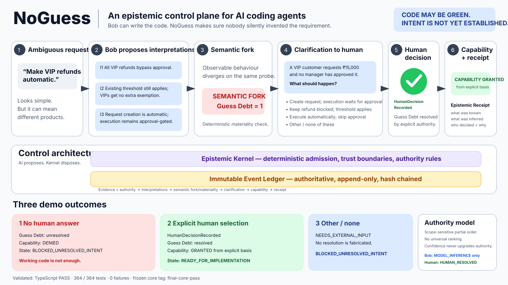

# NoGuess

> **Bob can write the code. NoGuess makes sure nobody silently invented the requirement.**

**NoGuess is an epistemic control plane for AI coding agents.**



AI coding agents are increasingly good at producing code that compiles, passes tests, and looks reasonable. But when a request is underspecified, an agent can silently convert a plausible assumption into an implementation requirement.

That creates a dangerous failure mode:

> **CODE WORKS. WRONG PRODUCT.**

NoGuess detects when plausible interpretations of a request imply materially different observable behaviour, blocks implementation authority while that ambiguity remains unresolved, asks the smallest useful human question, and records exactly why the agent was later allowed to act.

---

## The 15-second demo

A developer says:

> **"Make VIP refunds automatic."**

The existing system already says:

- refunds at or below ₹10,000 can use the automatic path;
- refunds above ₹10,000 require authorized approval;
- VIP status currently grants no refund-policy exemption.

But the request can still mean several different things.

NoGuess lets Bob propose interpretations, then compares their **observable effects**, not just their wording.

```text
"Make VIP refunds automatic."
             │
             ▼
      Bob proposes meanings
             │
             ▼
      observable behaviours
          diverge
             │
             ▼
        SEMANTIC FORK
             │
             ▼
        Guess Debt = 1
             │
             ▼
   implementation capability
           DENIED
             │
             ▼
  one discriminating question
             │
             ▼
     explicit human decision
             │
             ▼
      Guess Debt resolved
             │
             ▼
   implementation capability
           GRANTED
             │
             ▼
       Epistemic Receipt
```

The model does **not** get to decide which interpretation is correct.

---

## What the demo proves

Before human resolution:

```text
CODE MAY BE GREEN
INTENT IS NOT YET ESTABLISHED

Guess Debt: unresolved
Capability: DENIED
State: BLOCKED_UNRESOLVED_INTENT
```

NoGuess asks a neutral behaviour-level question:

> A VIP customer requests ₹15,000 and no manager has approved it. What should happen?

The choices represent materially different observable behaviours and always include:

> **Other / none of these**

After an explicit normal human selection:

```text
HumanDecisionRecorded
Guess Debt: resolved
Capability: GRANTED from explicit basis
State: READY_FOR_IMPLEMENTATION
```

If the human selects **Other / none of these**:

```text
NEEDS_EXTERNAL_INPUT
State: BLOCKED_UNRESOLVED_INTENT
```

NoGuess refuses to manufacture a decision merely to keep the agent moving.

---

## Why this is not just a clarification assistant

A normal clarification assistant can ask questions.

NoGuess controls whether the coding agent has **authority to act**.

The difference is the control loop:

```text
evidence
   ↓
interpretations
   ↓
semantic fork
   ↓
materiality
   ↓
Guess Debt
   ↓
human / authority resolution
   ↓
capability decision
   ↓
implementation authority
   ↓
Epistemic Receipt
```

Questions are generated only when competing interpretations cause a **material observable difference**.

Confidence does not upgrade authority.

A model inference does not become a human decision.

---

## Core rule

> **AI proposes. Kernel disposes.**

Bob may propose interpretations.

Bob cannot:

- declare ambiguity resolved;
- manufacture a human decision;
- grant itself execution capability;
- rewrite accepted event history;
- claim grounded evidence authority it does not possess;
- accept its own result.

The deterministic NoGuess kernel controls those transitions.

---

## Architecture

```text
Developer Request
       │
       ▼
┌──────────────────────────┐
│ Immutable Event Ledger   │
│ hash chained + append-only│
└────────────┬─────────────┘
             │
             ▼
┌──────────────────────────┐
│ Epistemic Kernel         │
│ deterministic admission  │
│ + emitter authority      │
└────────────┬─────────────┘
             │
             ▼
┌──────────────────────────┐
│ Evidence + Authority     │
│ explicit / repo / runtime│
│ model inference / human  │
└────────────┬─────────────┘
             │
             ▼
┌──────────────────────────┐
│ Bob Interpretations      │
│ proposals, not authority │
└────────────┬─────────────┘
             │
             ▼
┌──────────────────────────┐
│ Semantic Fork Detector   │
│ observable-effect diff   │
└────────────┬─────────────┘
             │
             ▼
┌──────────────────────────┐
│ Materiality              │
│ deterministic protected  │
│ effect comparison        │
└────────────┬─────────────┘
             │
      material fork?
       /           \
     no             yes
     │               │
     │               ▼
     │       ┌───────────────────┐
     │       │ Guess Debt        │
     │       │ capability denied │
     │       └─────────┬─────────┘
     │                 │
     │                 ▼
     │       ┌───────────────────┐
     │       │ Discriminating    │
     │       │ Human Question    │
     │       └─────────┬─────────┘
     │                 │
     │                 ▼
     │       HumanDecisionRecorded
     │                 │
     └────────┬────────┘
              ▼
┌──────────────────────────┐
│ Capability Gate          │
│ explicit evidence basis  │
└────────────┬─────────────┘
             │
             ▼
┌──────────────────────────┐
│ Epistemic Receipt        │
│ what was known           │
│ what was inferred        │
│ what diverged            │
│ who decided              │
│ why action was allowed   │
└──────────────────────────┘
```

---

## Semantic Forks

NoGuess does not treat different wording as meaningful by itself.

A semantic fork exists when two plausible interpretations produce different canonical observable effect signatures for the same probe.

Protected observable effects include:

- execution;
- authorization;
- data scope;
- persistence;
- external side effects.

A prose-only difference with identical observable behaviour does not create material Guess Debt.

---

## Guess Debt

**Guess Debt** is unresolved material implementation dependency.

It is a projection derived from the immutable ledger, not a second source of truth.

For the current vertical slice:

```text
1 unresolved material semantic fork
=
1 unresolved Guess Debt item
```

Until that debt is resolved, Bob's implementation capability is denied.

---

## Authority model

Evidence is not treated equally merely because a model is confident.

NoGuess distinguishes authority classes such as:

```text
HUMAN_RESOLVED
EXECUTABLE_CONTRACT
VERSIONED_POLICY
RUNTIME_OBSERVED
IMPLEMENTATION
DOCUMENTATION
MODEL_INFERENCE
```

Authority is scope-sensitive.

Confidence never upgrades authority.

Bob-generated evidence is restricted to model inference. A human decision must come through the explicit human-decision path.

---

## Epistemic Receipt

The receipt is an auditable projection of the run.

It exposes:

- the original request;
- evidence used;
- interpretations proposed;
- semantic forks;
- materiality decisions;
- clarification asked;
- human decisions;
- current Guess Debt;
- capabilities granted or denied;
- ledger integrity;
- ledger head hash.

It answers:

> What did the AI know?

> What did it infer?

> Where did plausible meanings diverge?

> What did a human actually decide?

> Why was the agent allowed to act?

---

## Run locally

### Requirements

- Node.js 22+
- npm

Install:

```bash
npm install
```

Typecheck:

```bash
npm run typecheck
```

Run the complete test suite:

```bash
npm test
```

Current validated result:

```text
364 tests
364 pass
0 fail
```

---

## Run the flagship demo

### 1. No human answer

```bash
npm run demo:vip-refund
```

Expected state:

```text
BLOCKED_UNRESOLVED_INTENT
```

The run should show unresolved Guess Debt and denied implementation capability.

### 2. Explicit human selection

The demo prints deterministic option IDs.

For example, to explicitly select one normal option:

```bash
node --import tsx scripts/demo-vip-refund.ts --answer opt-00
```

`opt-00` is a demonstration selection only.

It is **not** encoded as an objectively correct answer.

Expected transition:

```text
HumanDecisionRecorded
INTENT ESTABLISHED BY HUMAN DECISION
CAPABILITY GRANTED FROM EXPLICIT BASIS
READY_FOR_IMPLEMENTATION
```

### 3. Human rejects the offered interpretations

```bash
node --import tsx scripts/demo-vip-refund.ts --answer opt-other
```

Expected result:

```text
NEEDS_EXTERNAL_INPUT
BLOCKED_UNRESOLVED_INTENT
```

No resolution is fabricated.

---

## Repository structure

```text
src/epistemic/
├── evidence/       evidence projection + authority reasoning
├── intent/         interpretations, semantic forks, materiality, clarification
├── capability/     implementation capability decisions
├── receipt/        Epistemic Receipt projection
├── kernel/         deterministic event admission and trust boundaries
├── ledger.ts
├── sqlite-ledger.ts
└── events.ts

scripts/
├── demo-vip-refund.ts
└── run-tests.mjs

bob_sessions/
└── Bob IDE task evidence

compliance/
├── BOBCOIN_LOG.md
└── FINAL_CORE_BUILD_RECEIPT.md
```

---

## Built with IBM Bob

NoGuess was developed with **IBM Bob IDE as a core development component**.

The repository includes `bob_sessions/` evidence for the major implementation milestones.

The final Bob task exhausted the available hackathon Bobcoin allocation during demo validation. That task is recorded transparently as `BOB_LIMIT_REACHED`, not falsely labelled as a Bob-generated PASS.

The narrow final CLI hardening and independent validation performed afterward are documented in:

```text
compliance/FINAL_CORE_BUILD_RECEIPT.md
```

---

## Validation

The frozen core is tagged:

```text
final-core-pass
```

Validated state:

```text
TypeScript: PASS
Tests:      364 / 364
Failures:   0
```

The flagship scenario validates all three authority outcomes:

```text
No answer
→ BLOCKED_UNRESOLVED_INTENT

Explicit normal human decision
→ READY_FOR_IMPLEMENTATION

Other / none
→ NEEDS_EXTERNAL_INPUT
→ BLOCKED_UNRESOLVED_INTENT
```

---

## Evaluation status

Public validation currently includes:

- **364 / 364 tests passing**
- three reproducible flagship authority outcomes in `docs/DEMO_EVIDENCE.md`
- the public, non-secret **GuessBench-Bob v0.3 evaluation protocol** in `docs/BENCHMARK_PROTOCOL.md`

The benchmark protocol defines a 32-case design across Core, RealWorld, and Adversarial groups, but this repository does **not** claim a public aggregate hidden-benchmark score yet. Development-visible tests, behavioural demo evidence, and private evaluator results are kept separate.

---

## Current hackathon scope

The public hackathon slice implements:

- immutable event ledger;
- deterministic epistemic kernel;
- evidence and authority reasoning;
- Bob-proposed interpretations;
- semantic-fork detection;
- deterministic materiality;
- neutral discriminating clarification;
- explicit human resolution;
- Guess Debt projection;
- capability gating;
- capability invalidation after decision supersession;
- Epistemic Receipt;
- reproducible VIP-refund demonstration.

The broader architecture also defines a physically separate evaluator and GuessBench benchmark environment.

Those private evaluator assets and hidden expected answers are intentionally **not included in this public repository**.

---

## The idea in one sentence

**NoGuess turns "the code passed" into "the code was authorized by evidence."**
